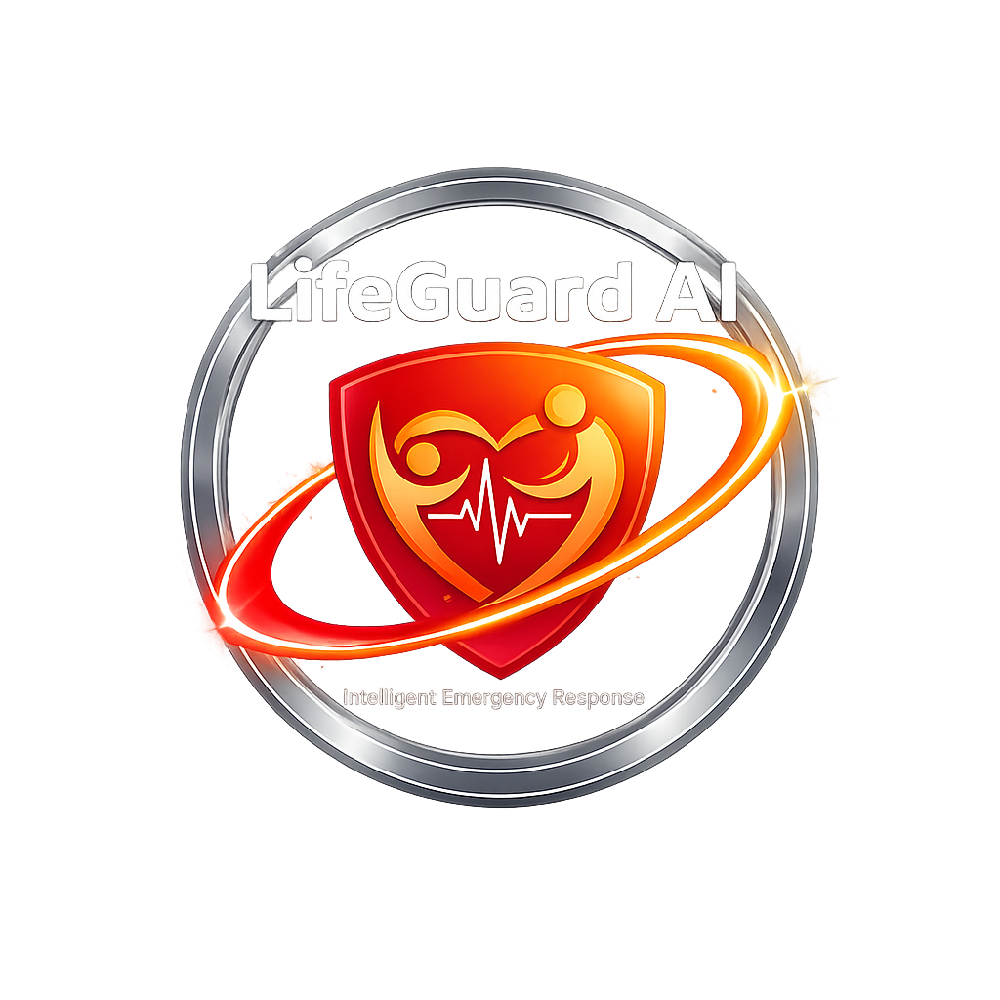

<p align="center">
  
</p>

<h1 align="center">🚨 LifeGuard AI 🚨</h1>
<p align="center">
  Real-time emergency response powered by <strong>Google Gemini AI</strong><br/>
  Turn your smartphone into a life-saving assistant
</p>

<p align="center">
  
  
  
  
</p>


---
## 🎬 Demo

<p align="center">
  
</p>

---
## 🏆 Gemini 3 Hackathon Alignment
- **Innovation**: Pioneering use of Gemini 3 for life-saving applications
- **Technical Excellence**: Sophisticated multimodal AI integration
- **Real-world Impact**: Addresses urgent public safety needs
- **Scalability**: Mobile-first approach for global accessibility

---
## Gemini 3 Integration

**LifeGuard AI** leverages **Google Gemini 3** to provide real-time emergency response directly on smartphones. The application uses Gemini 3’s **advanced multimodal analysis** capabilities to process both visual and audio input simultaneously, allowing the system to detect critical situations instantly. When a user triggers an emergency alert, the app streams images and audio to Gemini 3, which analyzes the scene in **under two seconds** and identifies potential hazards such as injuries, bleeding, or environmental threats.

To ensure accessibility and global usability, LifeGuard AI integrates **Gemini 3’s multilingual understanding**, supporting Arabic, French, and English. The AI generates **step-by-step voice guidance** in the selected language, guiding users through stabilization or first-aid procedures.

Gemini 3’s **low-latency reasoning** is central to the application’s performance, enabling immediate detection and response without delay. The app also implements a **smart retry mechanism**, leveraging Gemini 3’s robust API to maintain reliability even under unstable network conditions.

By combining **multimodal AI, real-time analysis, and multilingual support**, LifeGuard AI transforms smartphones into life-saving assistants, making Gemini 3 the **core engine** behind its emergency detection, decision-making, and user guidance capabilities. This integration demonstrates the unique potential of Gemini 3 for **social good**, delivering impactful and innovative solutions in critical situations.

---

## 🎯 Features

- **Real-time Analysis**: Instant emergency detection using Gemini's multimodal AI  
- **Multilingual Support**: Arabic, French, and English  
- **Voice Guidance**: Text-to-speech instructions in your language  
- **Mobile Optimized**: Works on phones and tablets  
- **Fast & Reliable**: Optimized for low-latency responses in critical moments  
- **Smart Retry**: Automatic retry mechanism for robust analysis  

---

## 💡 Gemini 3 Innovation
- **Advanced Multimodal Analysis**: Leveraging Gemini 3's enhanced image and audio processing
- **Real-time Emergency Detection**: Using Gemini 3's low-latency response capabilities
- **Multilingual Understanding**: Gemini 3 supports Arabic, French, and English for global accessibility


---

## 📈 Impact & Innovation
- **Lives Potentially Saved**: Real-time emergency response in critical moments
- **Accessibility**: 3 languages supported for diverse communities
- **Technology**: First mobile emergency app using Gemini 3 multimodal AI
- **Performance**: Sub-2 second response time for life-critical decisions


---

## 🚀 Quick Start

### Prerequisites

- Node.js 18+  
- Gemini API Key (get from [Google AI Studio](https://aistudio.google.com))  

### Installation

1. **Clone & Install**
```bash
git clone https://github.com/Mh-NOUHICoder/lifeguard-ai
cd lifeguard-ai
npm install
````

2. **Configure Environment**

```bash
# Create .env.local
echo "API_KEY=your_gemini_api_key_here" > .env.local
```

3. **Run Development Server**

```bash
npm run dev
```

4. **Open in Browser**

```
http://localhost:3000
```

---

## 🏗️ Project Structure

```
lifeguard-ai/
├── app/                        # The "Brain" of the Application
│   ├── api/
│   │   ├── analyze/route.ts    # Core AI analysis engine
│   │   └── test-gemini/        # Dev testing for AI
│   ├── emergency/page.tsx      # Specialized emergency interface
│   ├── globals.css             # Global styling and colors
│   ├── layout.tsx              # Main wrapper for the app
│   └── page.tsx                # Landing page & entry point
├── components/                 # The "Body" (UI Elements)
│   ├── CameraCapture.tsx       # Live camera & audio
│   ├── DangerAlert.tsx         # High-risk visual alerts
│   ├── EmergencyButton.tsx     # Push for help button
│   ├── LanguageSelector.tsx    # Multilingual toggle
│   └── DebugPanel.tsx          # Developer AI monitoring
├── lib/                        # The "Nervous System" (Core Logic)
│   ├── gemini.ts               # Bridge to Google Gemini AI
│   ├── prompt.ts               # AI reasoning logic
│   ├── tts.ts                  # Text-to-Speech engine
│   ├── translations.ts         # Multi-language dictionary
│   └── permissions.ts          # Camera/microphone access
├── public/                     # The "Visuals"
│   ├── assets/                 # Logos and graphics
│   ├── icons/                  # Mobile app icons
│   ├── manifest.json           # Makes app installable (PWA)
│   └── sw.js                   # Service worker
├── types/                      # Code "Definitions"
│   └── gemini.ts               # AI response types
└── README.md                   # Full documentation
```

---

## 📋 Emergency Types Detected

| Type                | Trigger                                 | Response                                   |
| ------------------- | --------------------------------------- | ------------------------------------------ |
| **Severe Bleeding** | Heavy bleeding, deep wounds, blood loss | Direct pressure, elevation, emergency call |
| **Fire/Smoke**      | Flames, fire, smoke                     | Evacuate, stop-drop-roll, call emergency   |
| **Not Emergency**   | Normal scene                            | No action needed                           |

---

## 📱 UX Flow

1. Select Language (AR / FR / EN)
2. Press Emergency Button (large red)
3. Allow Camera & Microphone access
4. Tap "ANALYZE SCENE" to capture image & audio
5. Receive instructions (displayed & spoken)
6. Optional: Call emergency services

---

## 🔊 Text-to-Speech

Supports natural speech in:

* **Arabic (ar-SA)** – Right-to-left
* **French (fr-FR)**
* **English (en-US)**

```typescript
import { speak, stopSpeech } from '@/lib/tts';

await speak("Emergency instruction", Language.ARABIC, {
  rate: 1.2,
  pitch: 1,
  volume: 1
});

stopSpeech();
```

---

---

## 🔒 Security

* API key in `.env.local` (never committed)
* No data logging of emergency scenes
* Client-side camera/audio processing only
* HTTPS required

---

## 🎮 Live Demo
**[Try LifeGuard AI Live](https://lifeguard-ai.vercel.app/)** - Experience the emergency response system in real-time

---

## 🤝 Contributing

1. Test edge cases
2. Report bugs with screenshots
3. Suggest UX improvements
4. Add more language support

---

## 📄 License

MIT License – Safe for personal & commercial use

---

## 🆘 Support

* Issues? Check browser console
* No camera? Grant browser permissions
* API errors? Verify Gemini API key

---

**Save lives. Every second counts. 🚨**

